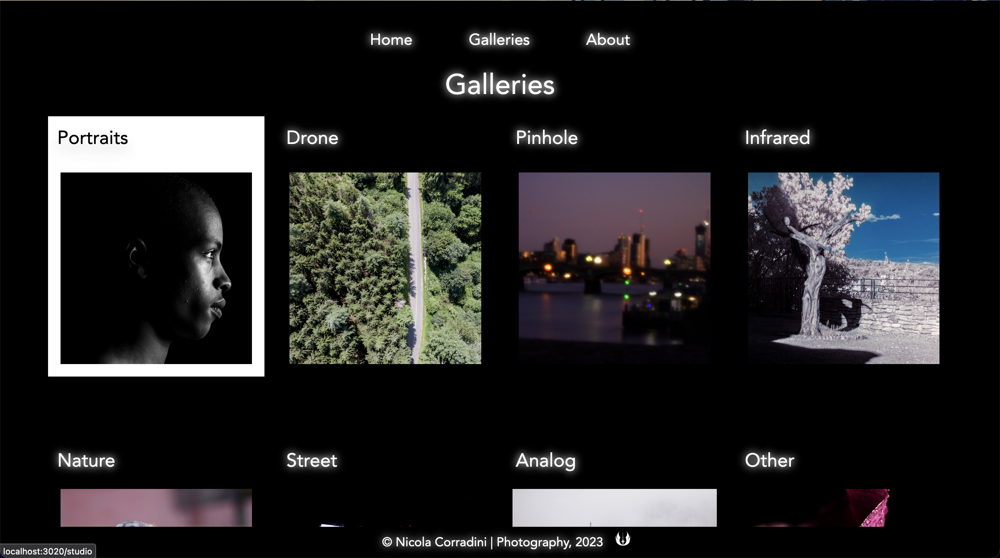

# Nicola Corradini | Photography

I've been capturing images for a spell. It's part of why I took up coding — to fashion an online gallery. I tinkered with techniques and gear, amassing a substantial assortment of photographs. The timing feels impeccable to unveil it to the masses!

Here I am:

## What did I use?

This is a front only web app, fashioned solo. These are the tools I utilized:

- [Vue.js](https://vuejs.org)
- [Tailwind CSS](https://tailwindcss.com)
- [Typescript](https://www.typescriptlang.org)
- [Vite](https://vitejs.dev)

## Want a quick preview of some photos and the project?

