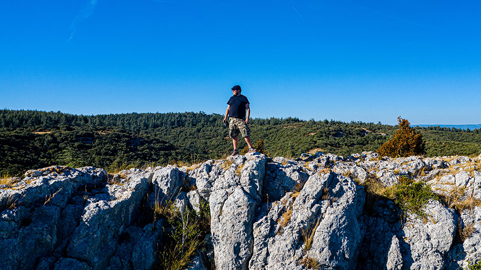
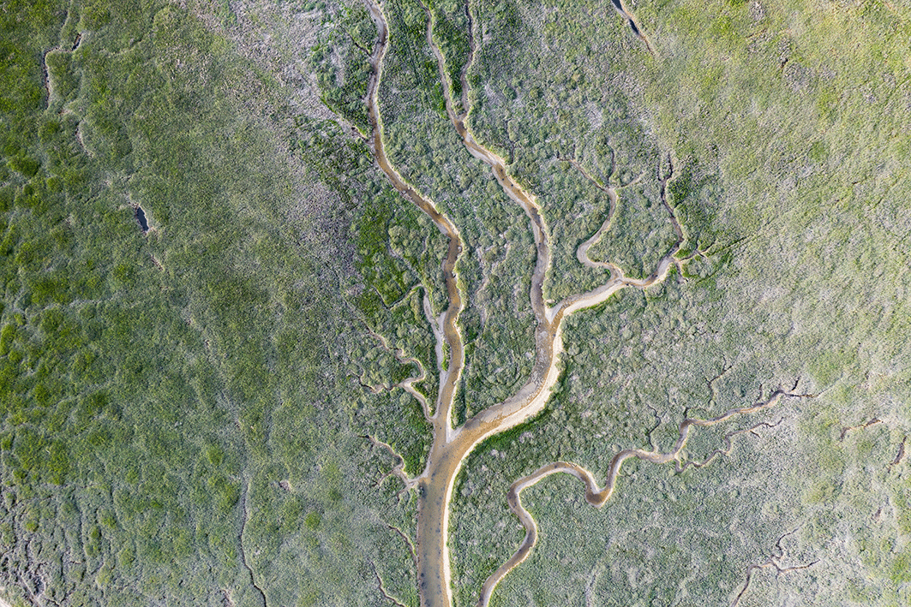

# Nicola Corradini | Photography

I've been capturing images for a spell. It's part of why I took up coding — to fashion an online gallery. I tinkered with techniques and gear, amassing a substantial assortment of photographs. The timing feels impeccable to unveil it to the masses!

Here I am:

In my online gallery, you'll find a collection of my own photographs. Through experimentation with various techniques and equipment, such as pinhole lenses, drones, infrared lenses, and analog cameras, I've captured unique and striking images that I'm proud to share with the world. Each photo tells a story, and I hope they inspire you as they have inspired me.

## What did I use?

This is a front only web app, fashioned solo. These are the tools I utilized:

- [Vue.js](https://vuejs.org)
- [Tailwind CSS](https://tailwindcss.com)
- [Typescript](https://www.typescriptlang.org)
- [Vite](https://vitejs.dev)

## Want a quick preview of some photos and the project?

